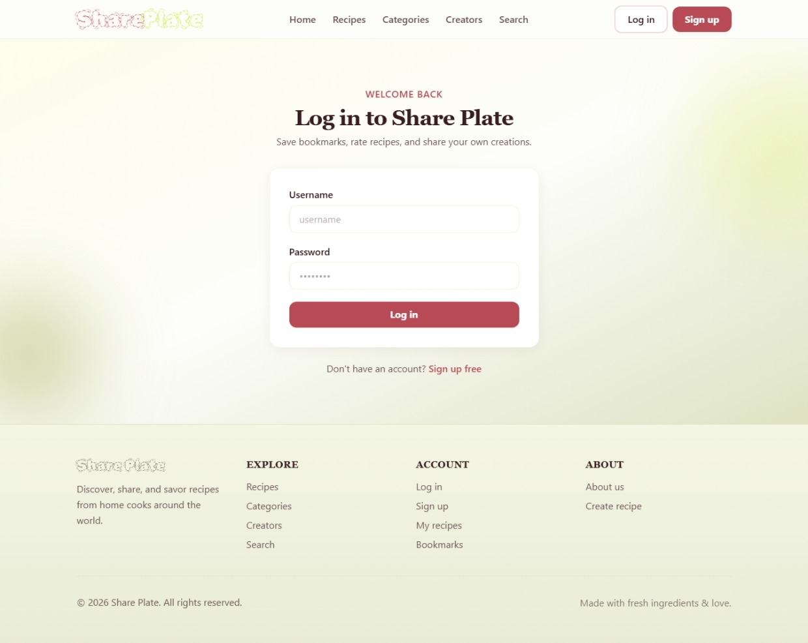
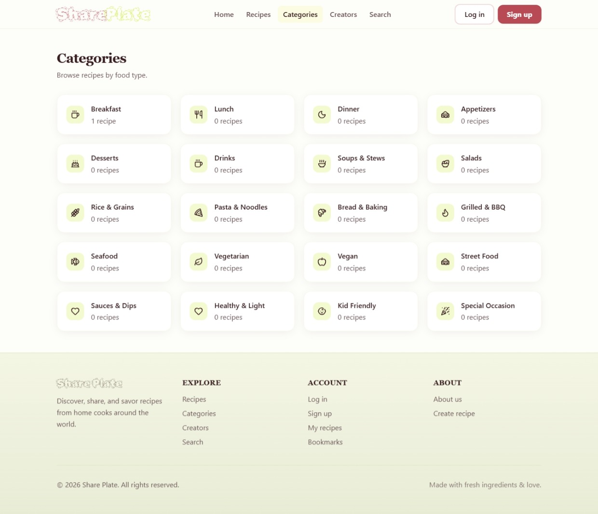

# 🍳 Food Recipe App

This is a simple recipe app I built to practice working with modern web technologies and GraphQL. The app allows users to browse recipes, search for dishes, and view ingredients and cooking instructions in an easy-to-use interface.

## What it does

Search for recipes
Browse different food categories

View ingredients and cooking steps
See cooking and preparation information
Responsive design that works on desktop and mobile

## Built With
Nuxt 4
Vue 3
Tailwind CSS
GraphQL
Apollo Client
